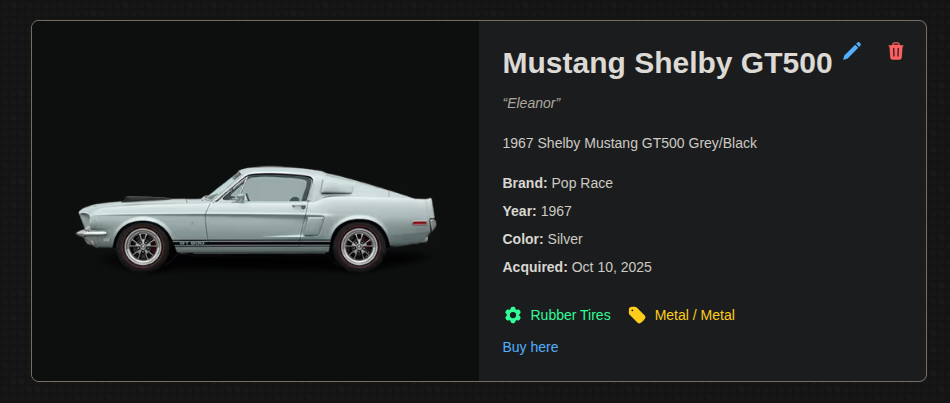

# Hot Wheels Collection :racing_car:

### _The Next.js Hot Wheels collection management system_

**by** [](http://fior.in)

## .: Frontend :.

#### Click [here to see the preview](public/preview.png)


The project was conceived as a comprehensive Hot Wheels diecast collection management system with timeline tracking, statistics, virtual shelf display, and acquisition history.

The following technologies were used in the frontend development:

| What?       | For what?              |
| ----------- | ---------------------- |
| Next.js     | Front-end structure.   |
| pnpm        | Dependency management. |
| Typescript  | Language used.         |
| TailwindCSS | Styling framework.     |
| Supabase    | Backend & Database.    |
| Heroicons   | Icon library.          |
| Recharts    | Charts & Statistics.   |
| Swiper      | Image gallery slider.  |
| React DnD   | Drag-and-drop shelf.   |
| Vitest      | Testing framework.     |

### Execution requirements

- Node.js
- pnpm (or npm)
- Supabase account & project

### Environment Setup

Create a `.env.local` file with your Supabase credentials:

```
NEXT_PUBLIC_SUPABASE_URL=your_supabase_url
NEXT_PUBLIC_SUPABASE_ANON_KEY=your_supabase_anon_key
```

### Installation & Running

To prepare the environment and run the application, run the commands:

```sh
$ pnpm install
$ pnpm run build
$ pnpm run start
```

The application will be available at:

```sh
http://localhost:3000
```

### Or running the development mode

To run the application in the dev mode, run the commands:

```sh
$ pnpm install
$ pnpm run dev
```

### Testing & Linting

To run tests and lint checks:

```sh
$ pnpm test          # Run tests in watch mode
$ pnpm test --run    # Run tests once
$ pnpm test:coverage # Run tests with coverage
$ pnpm lint          # Run ESLint
```

**by** [](http://fior.in)

---

#### Useful links

- [Next.js](https://nextjs.org/)
- [Supabase](https://supabase.com/)
- [TailwindCSS](https://tailwindcss.com/)
- [Heroicons](https://heroicons.com/)
- [Recharts](https://recharts.org/)
- [Swiper](https://swiperjs.com/)

